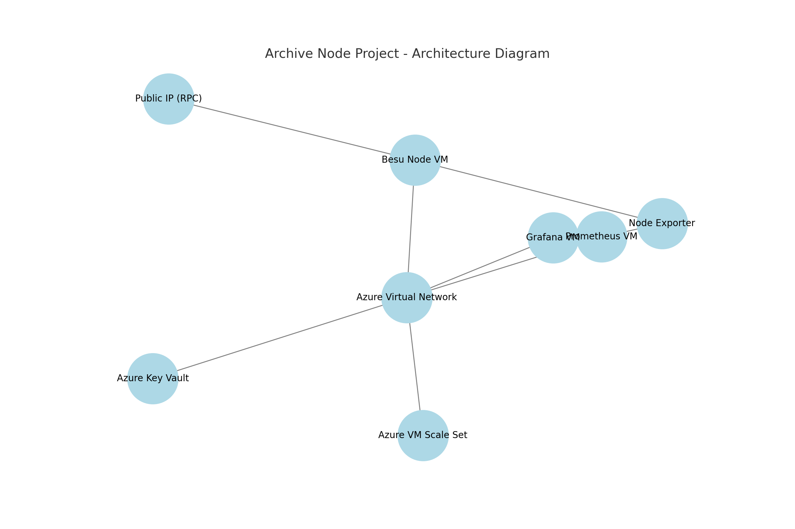

# Archive Node Project

## Overview
The Archive Node Project automates the deployment, monitoring, and scaling of Hyperledger Besu archive nodes on Azure. It includes scripts for enhanced security, real-time monitoring with Prometheus and Grafana, and scaling with Azure VM Scale Sets.

## Key Features
- Automated Deployment: Scripts for deploying Azure VMs, networks, and Besu nodes.
- Monitoring Stack: Pre-configured Prometheus and Grafana for real-time metrics.
- Scaling: Automatic scaling with Azure VM Scale Sets based on resource usage.
- Security: Managed identities, restricted SSH access, and Azure Defender integration.

## Deployment Guide
1. Clone the repository and navigate to the project directory.
2. Set up environment variables using `.env.example`.
3. Run the main deployment script.
4. Verify the setup using provided monitoring scripts.

## Architecture Diagram

## License
This project is licensed under the MIT License.
    